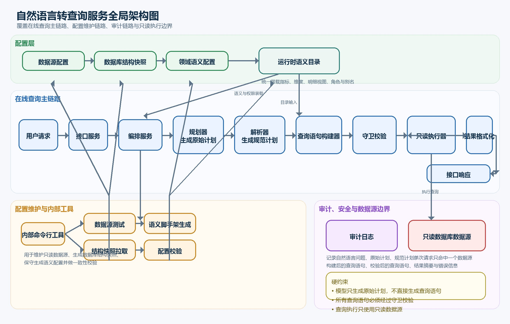

# NL2SQL

Internal NL2SQL backend service implemented in Go.

## 全局架构图

上图展示了系统的在线查询主链路、配置维护链路、审计链路与只读执行边界。
配置层负责提供运行时语义目录，内部命令行工具负责维护数据源和语义配置，编排服务串联规划、解析、构建、守卫、执行与格式化，审计模块记录全链路关键产物，执行阶段始终只访问只读数据源。

## Scope

- API-only in v1
- MySQL-only in v1
- Multiple readonly datasources at runtime
- Single datasource per request
- Aggregate queries and controlled detail-list queries
- No arbitrary SQL
- No cross-datasource execution

## Delivery Rules

- Core implementation follows test-driven development.
- The LLM generates `RawPlan`, not SQL.
- SQL is built by backend code from curated semantic config.
- Detail queries must go through approved `DetailViewSpec` definitions.

## Project Docs

- `docs/plans/2026-04-27-nl2sql-design.md`
- `docs/plans/2026-04-27-nl2sql-implementation.md`
- `docs/project-constraints.md`
- `docs/plans/verification-checklist.md`

## Initial Layout

- `cmd/server`: HTTP service entry point
- `cmd/nl2sqlctl`: internal config and schema tooling
- `configs`: datasource, generated schema, and domain semantics
- `db/migrations`: MySQL schema migrations for NL2SQL system tables
- `internal`: application code
- `pkg`: small reusable utility packages
- `tests`: smoke and integration tests

## Verification

- Full unit and package test run: `go test ./...`
- MySQL executor integration test: `go test ./tests/integration/mysql -run TestExecutorRunsReadonlyQueryAgainstMySQL -v`
- API smoke and checklist tests: `go test ./tests/smoke -v`
- Config validation CLI: `go run ./cmd/nl2sqlctl config validate`

## Git Hook

- Versioned pre-commit hook lives in `.githooks/pre-commit`.
- Install locally with `git config core.hooksPath .githooks`.
- The hook runs `go test ./...` and `scripts/check-encoding.ps1` to block failed tests, invalid UTF-8, and obvious Chinese mojibake.
